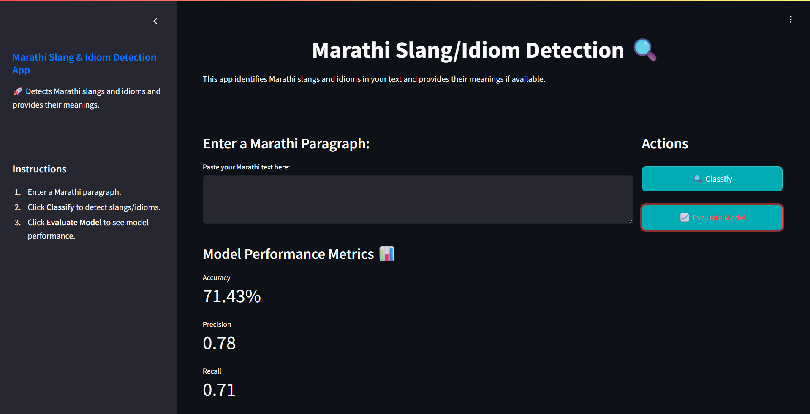
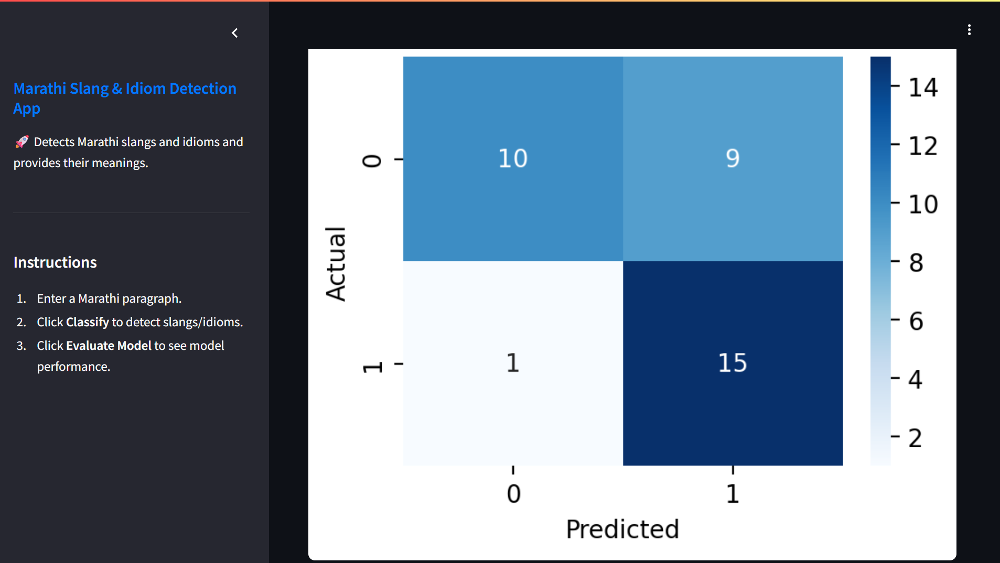
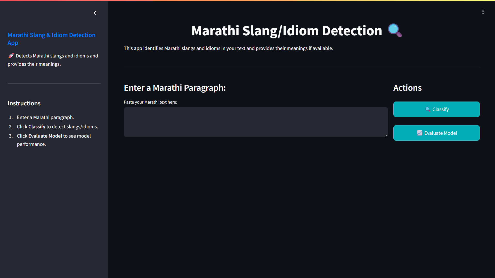
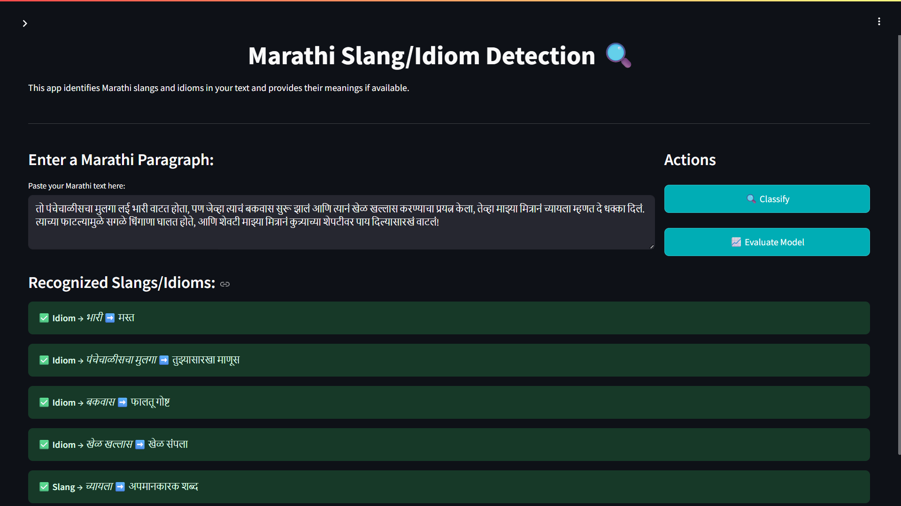
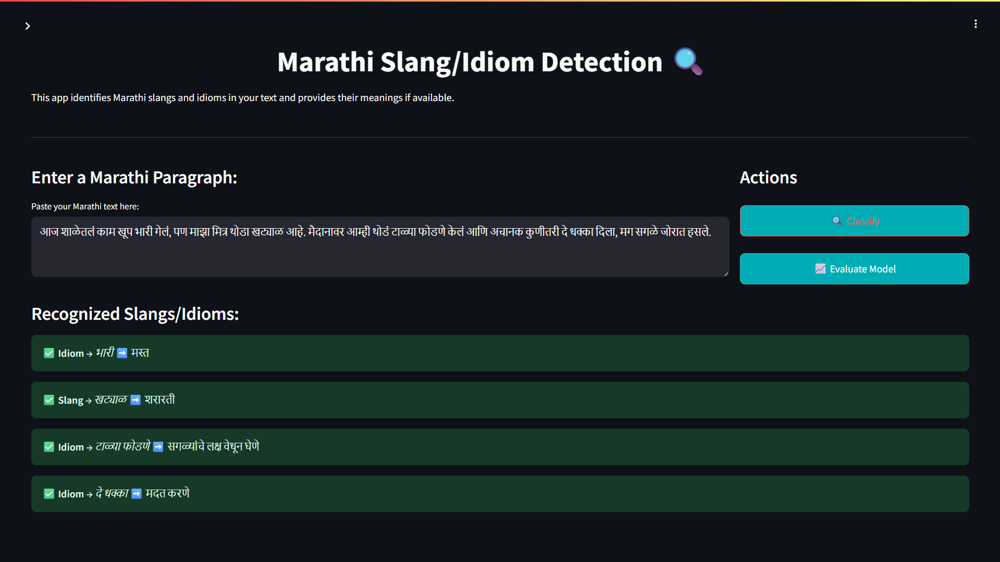
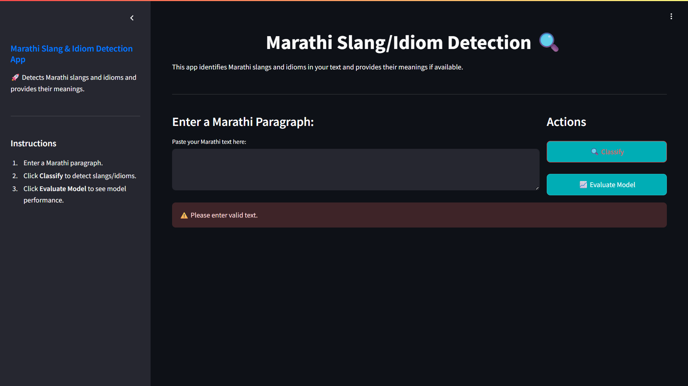

# Marathi Slang and Idiom Detection System

An **interactive web app** built with **Streamlit** that detects and categorizes Marathi slang and idioms in user-input text. Using advanced **NLP techniques** like **TF-IDF vectorization**, **lemmatization**, and a **Random Forest classifier** trained on a curated dataset, this tool identifies informal expressions, explains their meanings, and flags potential new slang terms.

---

## ✨ Features

- 🔍 **Detects** Marathi slang and idioms in text input  
- 🗂️ **Categorizes** expressions by contextual meaning  
- 🚩 **Flags** potential new slang expressions not present in the dataset  
- 📊 **Displays** real-time model performance metrics (accuracy, precision, recall)  
- 🎨 **User-friendly** interface powered by Streamlit  

---

## 🛠️ Technologies Used

- 🐍 Python  
- 📱 Streamlit (for interactive UI)  
- 🔬 Scikit-learn (Random Forest Classifier, TF-IDF Vectorization)  
- 📚 NLTK (Lemmatization for preprocessing)  

---

## 📷 App Preview

**Evaluation Metrics of Marathi Slang and Idiom Detection System**
  

  

  
**Marathi Slang and Idiom Detection System**
  

  

  

  

